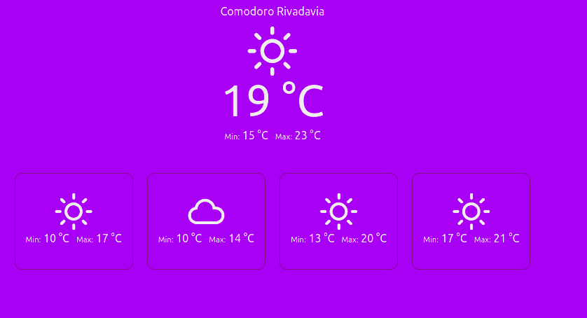

1) Renombrar el archivo .env.template a .env
2) Dentro del archivo .env setear REACT_APP_API_KEY con el valor de la api key obtenida en https://openweathermap.org/
3) Dentro del directorio ejecutar npm start

